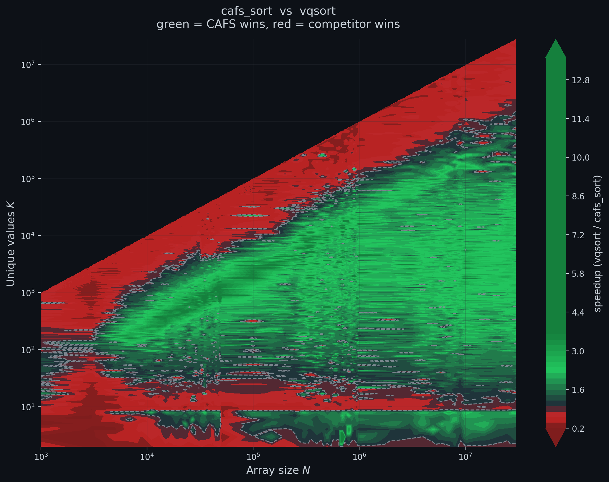
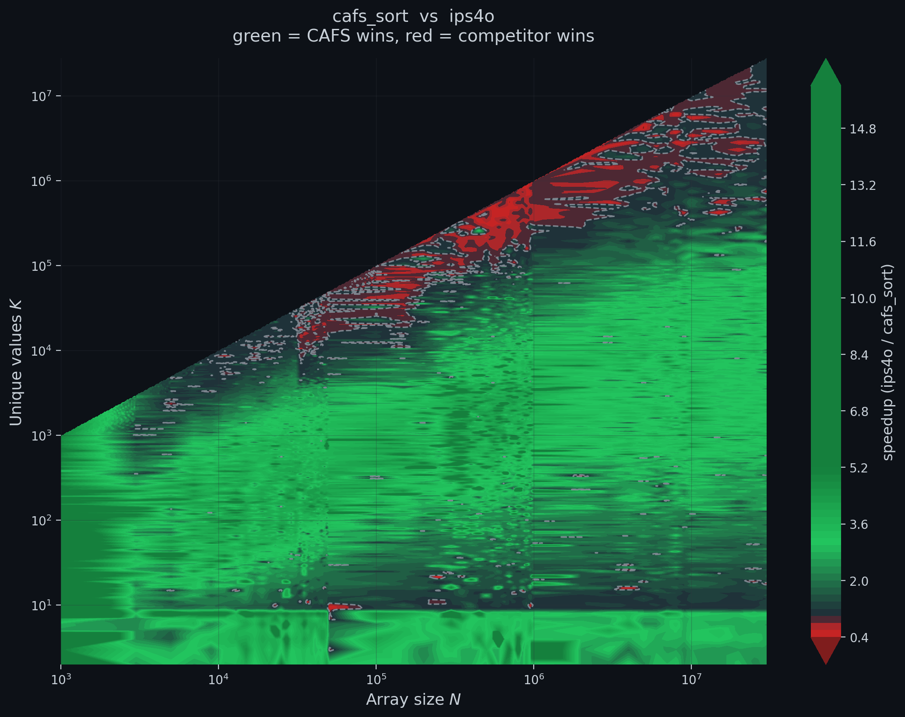
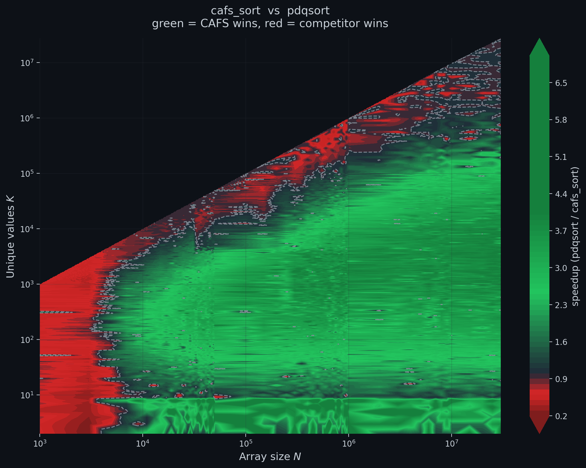
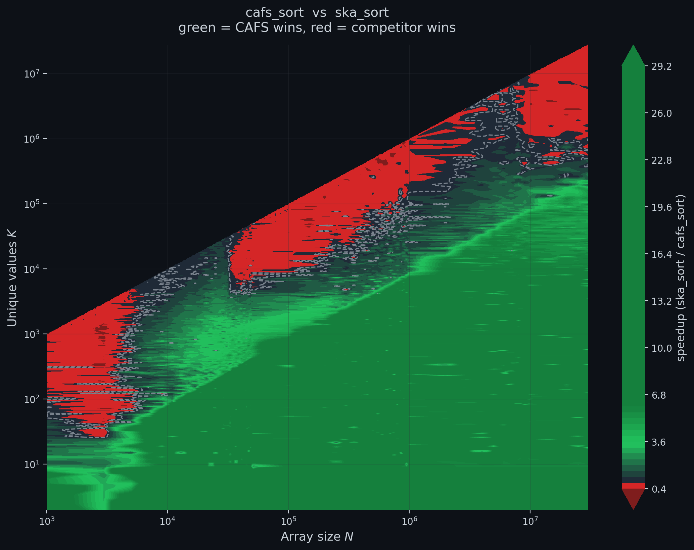

# CAFS

Cache-aware frequency sort: a header-only C++20 sort for low-cardinality integer arrays on x86-64.

<table>
  <tr>
    <td align="center"><br/><sub><b>vs vqsort</b> (Google Highway). Crossover at K = 6.7e5.</sub></td>
    <td align="center"><br/><sub><b>vs IPS4o</b>. Lead persists to K close to N.</sub></td>
  </tr>
  <tr>
    <td align="center"><br/><sub><b>vs pdqsort</b>. Crossover at K = 1.3e5.</sub></td>
    <td align="center"><br/><sub><b>vs ska_sort</b>. Crossover at K = 8.1e5.</sub></td>
  </tr>
</table>

Speedup of CAFS over each baseline across the (N, K) grid. Green is CAFS faster, red is the competitor faster. The dashed line traces parity. Bench platform: Intel Core i5-12400F, 32 GB DDR4-3200, g++ 13.2 -O3 -mavx2 -mbmi.

CAFS targets integer columns where the number of distinct values K is much smaller than the array length N. The hot loop is one AVX2 cmpeq per element on a 64-byte cache-line bucket; an adaptive dispatcher routes high-entropy inputs to pdqsort. On a 1600-point (N, K) grid (592770 measurements) the bin-mean speedup is 1.7 to 3.1 times pdqsort, 1.97 to 3.52 times IPS4o, 1.27 to 2.34 times vqsort, 4 to 17 times ska_sort, and 8 to 17 times std::sort across the K << N band. Per-baseline crossover points are listed in [Benchmark results](#benchmark-results).

## C++ usage

CAFS is header-only. Include cafs2.hpp and call cafs2::cafs_sort on a std::vector of an integral type.

```cpp
#include "cafs2.hpp"
#include <vector>
#include <cstdint>

int main() {
    std::vector<uint64_t> data = {7, 2, 7, 9, 2, 7, 9, 9, 2, 7};
    cafs2::cafs_sort(data);
}
```

The default fallback for inputs outside the target zone is std::sort. To use pdqsort as the fallback:

```cpp
#include "cafs2.hpp"
#include "pdqsort.h"

cafs2::cafs_sort(data, [](auto& v){ pdqsort(v.begin(), v.end()); });
```

AVX2 specializations exist for int32_t, int64_t, and uint64_t. Other integral types compile through a scalar bucket path with no loss of correctness.

## Bindings

Thin wrappers in [`bindings/`](bindings/) for Python, Rust, and Go. All three expose a single `sort` entry point that accepts the supported integer types (`uint64`, `int64`, `int32`).

```python
import numpy as np, cafs
data = np.random.default_rng(0).integers(0, 1000, size=1_000_000, dtype=np.uint64)
cafs.sort(data)
```

```rust
use cafs::sort;
let mut data: Vec<u64> = vec![7, 2, 7, 9, 2, 7];
sort(&mut data);
```

```go
import cafs "github.com/kexibq-official/cafs-lib/bindings/go"
data := []uint64{7, 2, 7, 9, 2, 7}
cafs.Sort(data)
```

See [bindings/README.md](bindings/README.md) for installation and per-binding details.

## Requirements

- x86-64 with AVX2 and BMI1
- C++20 (uses std::bit_ceil, std::bit_width, std::countr_zero)
- g++ 13 or later, or clang 16 or later

## Building the benchmark

The benchmark in benchmark/main_bigdata.cpp drives the (N, K) landscape used in the preprint and writes results to a CSV file. pdqsort.h is required because main_bigdata.cpp uses it as the CAFS dispatcher fallback. ska_sort, IPS4o, and Google Highway / vqsort are optional: the benchmark detects each one through __has_include and runs with whichever subset is present. See benchmark/third_party/README.md for the per-dependency setup.

Direct compilation, without vqsort:

```
g++ -O3 -mavx2 -mbmi -std=c++20 -DNDEBUG \
    -Iinclude benchmark/main_bigdata.cpp -o bench_grid
```

CMake build, which picks up Highway / vqsort when benchmark/third_party/highway_repo is populated:

```
cmake -S benchmark -B build -DCMAKE_BUILD_TYPE=Release
cmake --build build -j
```

Run the sanity test:

```
g++ -O3 -mavx2 -mbmi -std=c++20 -DNDEBUG -Iinclude tests/sanity.cpp -o sanity
./sanity
```

## When to use CAFS

Typical inputs that match the target zone:

- categorical fields (status, type, tag, country code, log level)
- foreign keys into small dimension tables
- quantized numeric features after bucketing
- post-group-by intermediate columns in OLAP query plans

Per-baseline operational crossover at N > 1e6:

| Baseline   | CAFS leads up to | Past the crossover                         |
|------------|------------------|--------------------------------------------|
| std::sort  | K = N            | CAFS still wins (introsort is the weak baseline) |
| pdqsort    | K = 1.3e5        | converges to parity                        |
| IPS4o      | K = N            | converges to parity, no sharp boundary     |
| ska_sort   | K = 8.1e5        | ska_sort wins on K close to N              |
| vqsort     | K = 6.7e5        | vqsort wins by 1.5 to 2 times              |

For inputs that may push K close to N, vqsort is the better choice. The CAFS dispatcher catches that case via the `K_est * 2 > N` guard and falls back to pdqsort, capping the worst case observed in the grid at about 5 times pdqsort time.

## Benchmark results

Bench platform: Intel Core i5-12400F, 32 GB DDR4-3200, Windows 11, g++ 13.2 with -O3 -mavx2 -mbmi -DNDEBUG. Each entry is the bin-mean of speedup = t_baseline / t_CAFS within the entropy bin H = ceil(log2 K), aggregated across the (N, K) grid (1600 points, 592770 measurement rows).

| H, bits | K range            | std::sort | pdqsort | ska_sort | IPS4o | vqsort |
| ------: | -----------------: | --------: | ------: | -------: | ----: | -----: |
|       2 | 4 to 8             |     17.10 |    3.10 |    16.96 |  3.50 |   1.32 |
|       5 | 32 to 64           |     12.21 |    2.30 |     7.60 |  2.57 |   1.27 |
|       9 | 512 to 1024        |     14.74 |    3.07 |     5.87 |  3.52 |   2.34 |
|      13 | 8192 to 16384      |      9.46 |    2.12 |     2.45 |  2.18 |   1.59 |
|      17 | 131072 to 262144   |      5.30 |    1.29 |     1.26 |  1.33 |   1.01 |
|      19 | 524288 to 1048576  |      3.70 |    1.00 |     0.87 |  1.01 |   0.73 |
|      23 | 8.4e6 to 1.7e7     |      3.47 |    1.00 |     0.66 |  1.00 |   0.60 |

Crossover points at N > 1e6: pdqsort and std::sort at K = 1.7e7 (parity at K = N); ska_sort at K = 8.14e5; vqsort at K = 6.72e5; IPS4o at K = 1.7e7. Full landscape, raw CSV, and analysis scripts ship with the preprint artifact.

## Citation

```
@article{shlyk2026cafs,
    title         = {{CAFS}: A Cache-Aware Frequency Sort for Low-Cardinality Integer Data on x86-64},
    author        = {Shlyk, Vasiliy S.},
    year          = {2026},
    eprint        = {XXXX.YYYYY},
    archivePrefix = {arXiv},
    primaryClass  = {cs.DS}
}
```

## License

MIT. See LICENSE.
